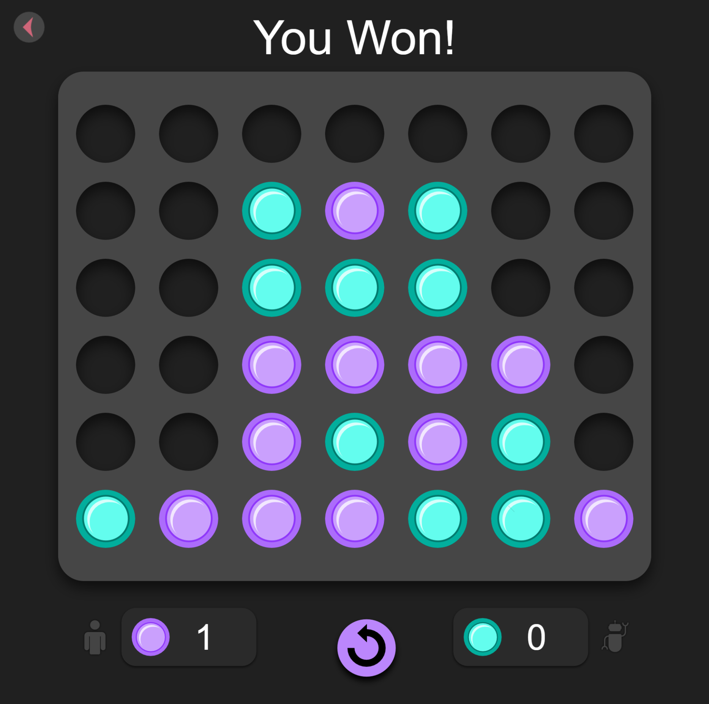

# Connect 4 UI



[](https://github.com/brajkowski/connect4-ui/actions/workflows/build.yml)

A 2-player (local and multiplayer) version of Connect 4 created with [Phaser](https://phaser.io/).

## Building from Source

Using npm:

```
$ npm run build
```

will produce the compiled application under `/dist`.

## Running the Application

A live-reload instance of the application can be used for developing:

```
$ npm run start:dev
```

You may also run the same instance with the port open externally:

```
$ npm run start:local
```

You may run the compiled application as well:

```
$ npm run build
$ npm start
```

## Testing

The test suite can be executed with npm:

```
$ npm test
```
